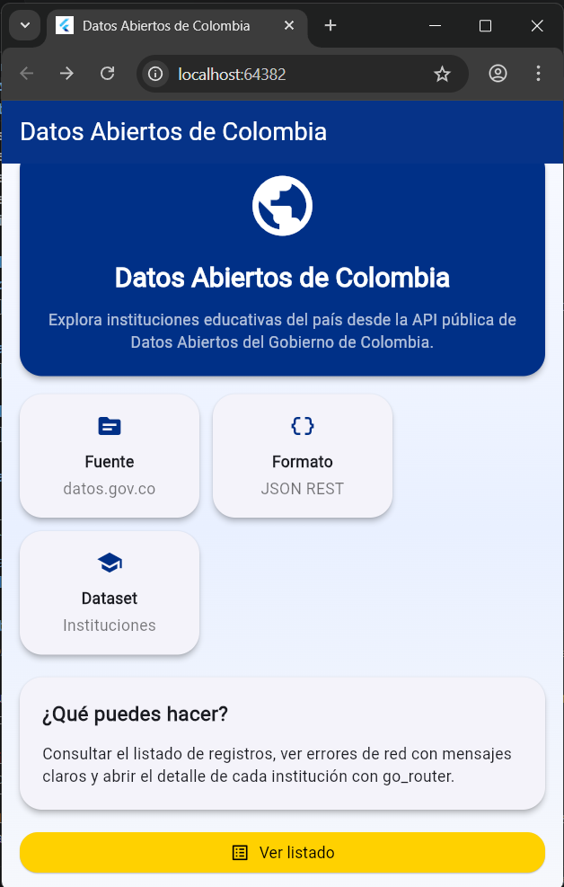
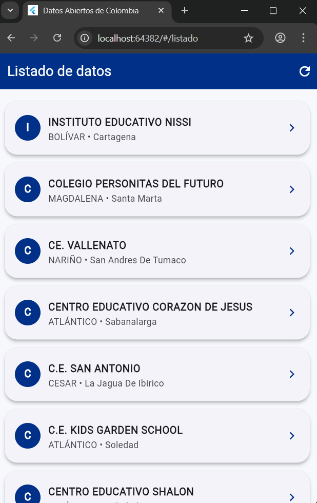
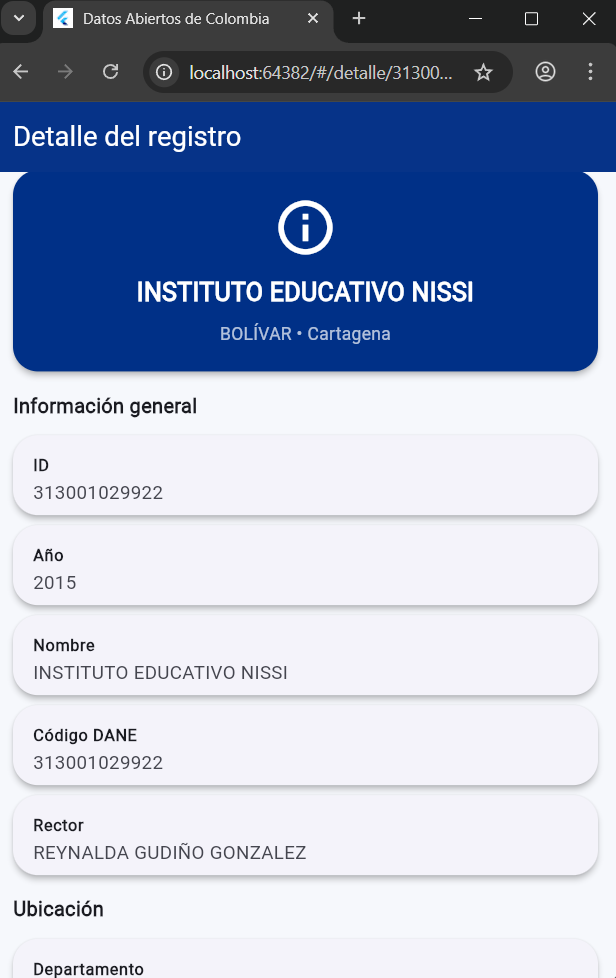
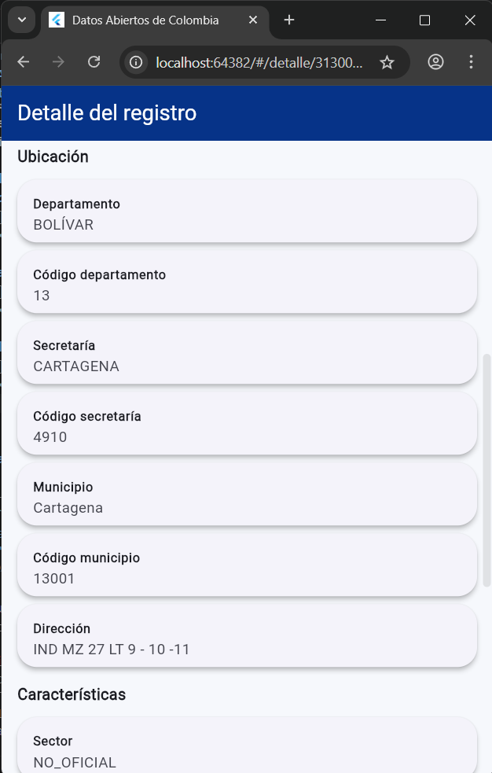
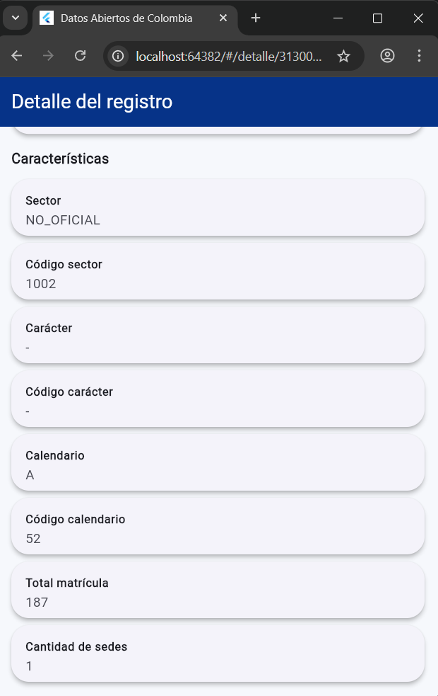

# Datos Abiertos de Colombia - Flutter App

## Descripcion del proyecto
Aplicacion movil desarrollada en Flutter que consume datos publicos de Colombia desde dos fuentes:
- Datos Abiertos del Gobierno de Colombia (datos.gov.co)
- API Colombia (api-colombia.com)

La app permite navegar con go_router entre Dashboard, Listado y Detalle para ambos modulos, con manejo de estados de carga, exito y error, y separacion por capas.

## APIs usadas

### 1) Datos Abiertos de Colombia (datos.gov.co)
- URL base: https://www.datos.gov.co/resource/
- Dataset: Instituciones Educativas de Colombia
- ID dataset: cfw5-qzt5.json

### 2) API Colombia (api-colombia.com)
- URL base: https://api-colombia.com/api/v1
- Recurso implementado: Department

## Endpoints implementados (4)

### Endpoint 1 - Listado de instituciones educativas
```http
GET https://www.datos.gov.co/resource/cfw5-qzt5.json?$limit=20&$offset=0
```
Retorna los primeros 20 registros del dataset.

### Endpoint 2 - Detalle de institucion por codigo DANE
```http
GET https://www.datos.gov.co/resource/cfw5-qzt5.json?$where=codigo_dane='VALOR'&$limit=1
```
Retorna una institucion especifica. Incluye fallback por nombre_establecimiento si no hay coincidencia por codigo_dane.

### Endpoint 3 - Listado de departamentos
```http
GET https://api-colombia.com/api/v1/Department
```
Retorna el listado de departamentos de Colombia.

### Endpoint 4 - Detalle de departamento por id
```http
GET https://api-colombia.com/api/v1/Department/{id}
```
Retorna la informacion completa de un departamento.

## Arquitectura del proyecto

Estructura por capas:

```text
lib/
  config/
    app_config.dart
  models/
    item_model.dart
    department_model.dart
  services/
    api_service.dart
    api_colombia_service.dart
  routes/
    app_router.dart
  themes/
    app_theme.dart
  views/
    dashboard_view.dart
    listado_view.dart
    detalle_view.dart
    listado_departamentos_view.dart
    detalle_departamento_view.dart
  widgets/
    item_card.dart
    department_card.dart
main.dart
```

## Navegacion con go_router

| Ruta | Nombre | Descripcion | Parametros |
|------|--------|-------------|------------|
| `/` | `dashboard` | Pantalla principal | - |
| `/listado` | `listado` | Listado de instituciones | - |
| `/detalle/:id` | `detalle` | Detalle de institucion | `id` + `item` (extra) |
| `/departamentos` | `listadoDepartamentos` | Listado de departamentos | - |
| `/departamentos/detalle/:id` | `detalleDepartamento` | Detalle de departamento | `id` + `department` (extra) |

La navegacion usa context.goNamed con pathParameters y extra para reutilizar datos ya cargados y evitar peticiones innecesarias cuando sea posible.

## Manejo de estados

Todos los listados y detalles estan implementados con FutureBuilder, contemplando explicitamente:
- Cargando: CircularProgressIndicator
- Error: mensaje + boton Reintentar
- Exito: render de datos en lista o tarjetas de detalle

Adicionalmente, los listados tienen RefreshIndicator para recarga manual.

## Variables de entorno (.env)

```env
BASE_URL=https://www.datos.gov.co/resource/
DATASET_ID=cfw5-qzt5.json
APP_TOKEN=
API_COLOMBIA_BASE_URL=https://api-colombia.com/api/v1
```

## Paquetes implementados

| Paquete | Version | Uso |
|---------|---------|-----|
| http | ^1.2.0 | Peticiones HTTP |
| go_router | ^13.0.0 | Navegacion declarativa |
| flutter_dotenv | ^5.1.0 | Variables de entorno |

## Pantallas

### Dashboard
Muestra resumen del proyecto y accesos directos a:
- Listado de instituciones
- Listado de departamentos



### Listado de instituciones
Listado de 20 instituciones con estados de carga/error/exito.



### Detalle de institucion
Detalle completo de una institucion educativa.





### Listado de departamentos
Nuevo listado consumiendo API Colombia.

### Detalle de departamento
Nuevo detalle por id consumiendo API Colombia.

## Notas tecnicas

- Se mantuvo el modulo de instituciones existente y se agrego un modulo paralelo para departamentos.
- Se preservo el enfoque por capas (models, services, views, widgets, routes).
- Se mantuvo el mismo patron de UX para estados de red en todos los endpoints.
- Las validaciones realizadas incluyen analisis estatico y ejecucion en web sin errores.
##
viva colombia
-cafe
-pandebono


